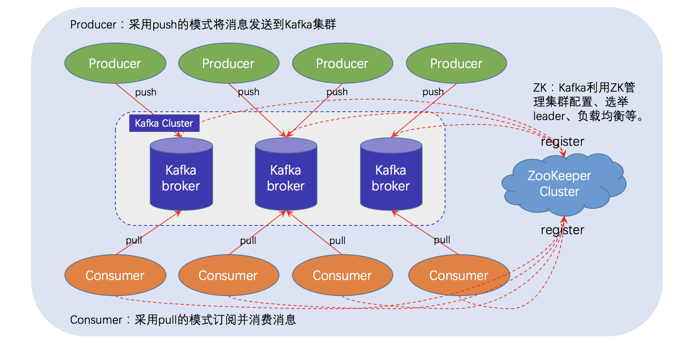

# Kafka 的体系结构



## 初识Kafka

+ A distributed streaming platfrom

+ Kafka是基于zookeeper的分布式消息系统

+ Kafka具有高吞吐率，高性能，实时极高可靠等特点

## 配置Kafka

+ 安装JDK

+ 启动Zookeeper

```xml
# 进入到Zookeeper安装包下
# cd conf 
# cp zoo_sample.cfg zoo.cfg 保留默认配置
# cd bin 运行命令./zkServer.sh start 启动Zookeeper
```

+ 启动Kafka
```xml
# 启动Kafka
bin/kafka-server-start.sh config/server.properties &

# 停止Kafka
bin/kafka-server-stop.sh

# 创建Topic
bin/kafka-topics.sh --create --zookeeper localhost:2181 --replication-factor 1 --partitions 1 --topic huanggang

# 查看已经创建的Topic信息
bin/kafka-topics.sh --list --zookeeper localhost:2181

# 发送消息
bin/kafka-console-producer.sh --broker-list localhost:9092 --topic huanggang

# 接受消息
bin/kafka-console-consumer.sh --bootstrap-server localhost:9092 --topic huanggang --from-beginning
```

## 腾讯云远程连接Kafka

https://www.cnblogs.com/hjy415340835/p/11111563.html

## kafka基本概念

+ Topic : 一个虚拟的概念，有1到多个Partitions组成
+ Partition : 实际消息存储单位
+ Producer : 消息生产者
+ Consumer : 消费消息者

## Kafka 客户端操作

**Kafka客户端API类型**
+ AdminClient API : 允许管理和检测Topic,broker以及其他Kafka对象
+ Producer API : 发布消息到1个或多个topic 
+ Consumer API : 订阅一个或多个topic,并处理产生的消息
+ Stream API ： 高效的将输入流转换到输出流
+ Connector API : 从一些源系统或应用程序中拉取数据到Kafka


## AdminClient API

| API | 作用|
|------|------|
|AdminClient|AdminClient客户端对象|
|NewTopic|创建Topic|
|CreateTopicsResult|创建Topic的返回结果|
|ListTopicsResult|创建Topic列表|
|ListTopicsOptions|查询Topic列表及选项|
|DescribeTopicsResult|查询Topics|
|DescribeConfigsResult|查询Topics配置项|

