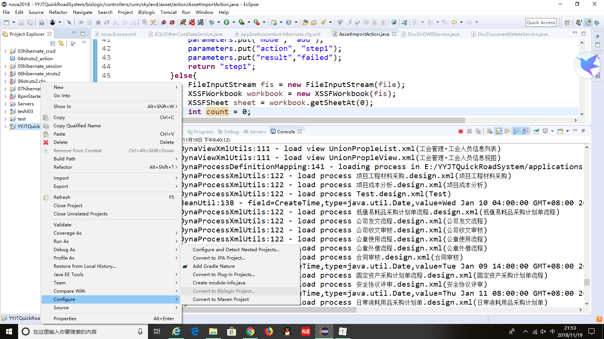
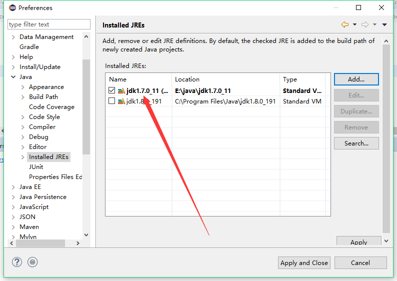
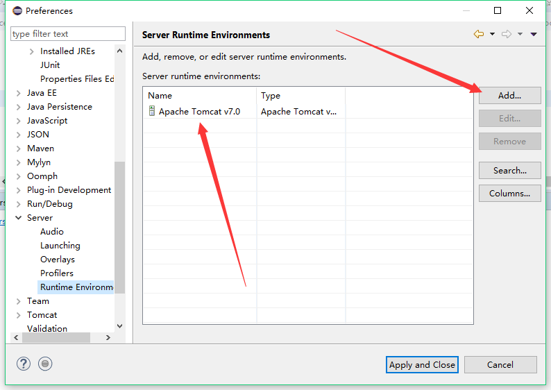
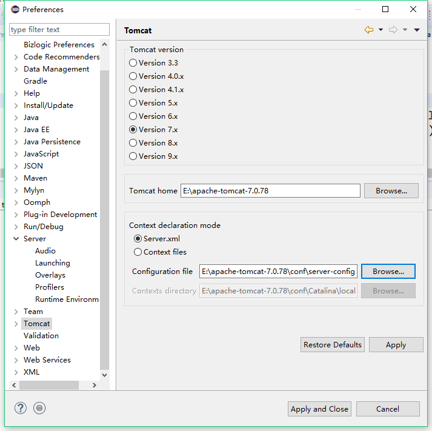
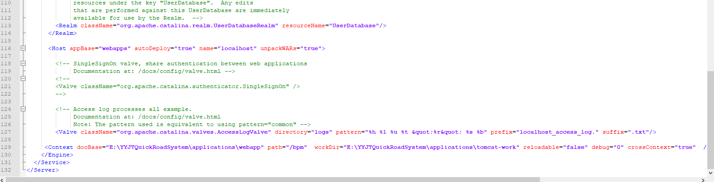
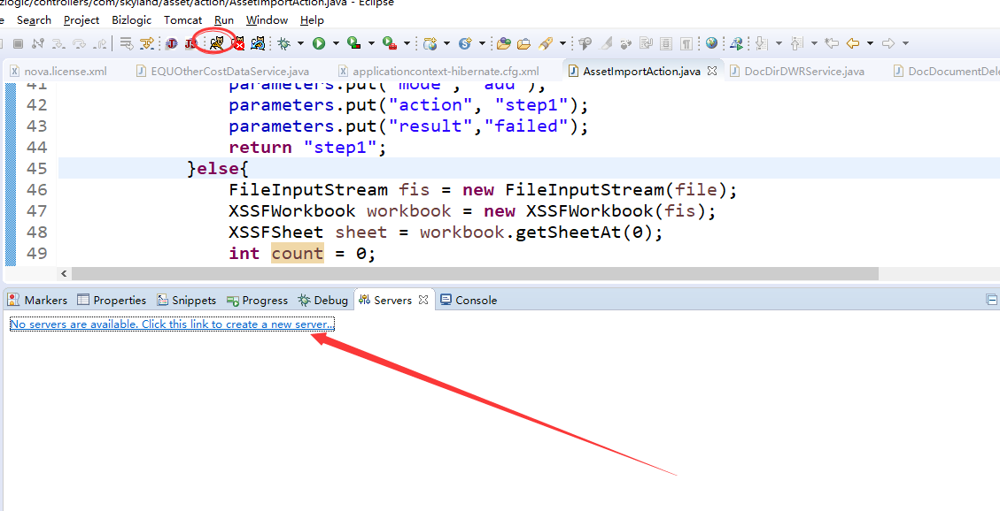
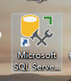
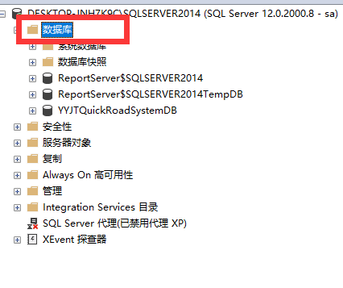
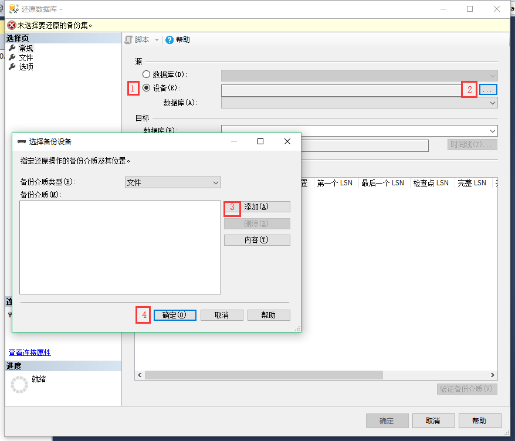

## 项目配置流程

### 1.项目下载

安装`svn`,根据`svn`链接导出项目，下载到某个空的文件夹中

### 2.新建项目

#### 该项目与`svn`项目同名


#### 导入原来项目

```
项目右键->Config->Convert to Bizlogic Project->...->找到项目中的webapps,
```




### 3.配置项目

配置`JDk`,确保`JDK`配置完成

配置`tomcat`，注意`Tomcat`使用公司的`tomcat`，从公司硬盘中拷贝，

需配置如下信息

在此处添加一个`jdk`



在此处添加一个`server`



在此处添加`Tomcat home` 与`configuration file`




注意`server-config.xml`文件是`tomcat`中`server.xml`文件的副本，该副本的名字一般重命名为项目名`.xml`,须修改一下信息



```xml
<Context docBase="E:\YYJTQuickRoadSystem\applications\webapp" path="/bpm"  workDir="E:\YYJTQuickRoadSystem\applications\tomcat-work" reloadable="false" debug="0" crossContext="true"  /></Host>
```

`path`固定是`/bpm`

配置 `tomcat`不需要在此处添加`server`,运行是只需点击小猫图标即可



### 4.配置数据库

下载安装对应版本的`sqlserver`，安装客户端工具安装完成后，还原数据库。

还原数据库

```
数据库->右键->还原数据库
```



按照以下四个步骤还原数据库,第三部选择需要还原的数据库备份文件。



### 5.修改配置文件

修改`applicationcontext-hibernate.cfg.xml`文件中的数据库相关信息

修改`nova.license.xml`中的`license`。

### 6.运行项目