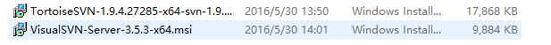
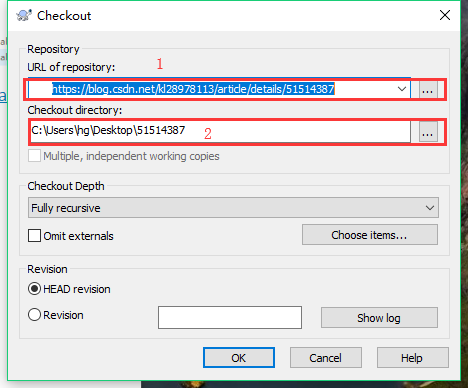

## svn的使用

### 1.svn安装

安装如下两个工具

具体安装步骤https://blog.csdn.net/kl28978113/article/details/51514387 查看该篇博客。

安装完成后`右键`->`svn Checkout`,出现如下图

位置1输入项目`url`,位置2输入下载目录。

### 2.如何使用SVN上传、添加、删除文件

https://jingyan.baidu.com/article/9f7e7ec0b031a36f29155442.html